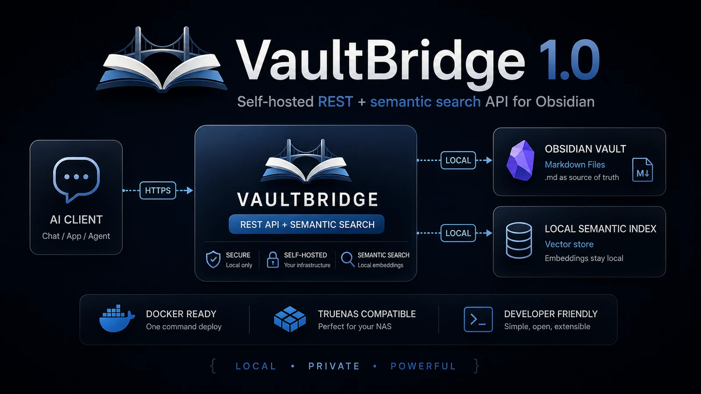

<p align="center">
  
</p>

<p align="center">
  <strong>VaultBridge is a self-hosted REST + semantic search API for Obsidian Markdown vaults.</strong>
</p>

<p align="center">
  Keep Markdown as the source of truth while giving AI clients, scripts, and automations a small
  authenticated interface for reading, searching, and safely writing notes. Semantic retrieval runs
  locally, and the derived index remains disposable.
</p>

<p align="center">
  <a href="https://github.com/mrtrollex/VaultBridge/releases/tag/v1.0.0"></a>
  <a href="LICENSE"></a>
  <a href="pyproject.toml"></a>
  <a href="https://github.com/mrtrollex/VaultBridge/pkgs/container/vaultbridge"></a>
</p>

<p align="center">
  <a href="#quick-start">Quick start</a> ·
  <a href="#current-api">API</a> ·
  <a href="README_TRUENAS.md">TrueNAS</a> ·
  <a href="https://richardsenko.com/vaultbridge-1-0/">Story behind v1.0</a>
</p>

<p align="center">
  
</p>

> **Release status:** VaultBridge `v1.0.0` is released. Its stable source, GitHub Release, public
> GHCR image, and exact-digest TrueNAS runtime were verified. Current development includes post-v1.0
> capabilities; see [`ROADMAP.md`](ROADMAP.md) for the current state and historical release scope.

## Why VaultBridge

VaultBridge sits between an Obsidian vault and API-capable clients such as ChatGPT, scripts,
automations, or future applications. Its boundaries are intentionally narrow:

- Markdown files remain authoritative and usable without VaultBridge.
- Semantic data is local, derived, disposable, and rebuildable from the vault.
- The API exposes a small set of authenticated note and search operations, not general filesystem
  access.
- Vault-relative path validation and containment keep clients inside the configured vault.
- The service is client agnostic and needs only a normal self-hosted Docker setup plus SQLite.

The architecture remains understandable without the graphic:

```text
Client
  |
  | HTTPS + Bearer key
  v
VaultBridge (FastAPI)
  |                 \
  v                  v
Markdown vault    Semantic retrieval
                     |
                 FastEmbed/ONNX
                     |
                 SQLite index
```

The vault is never replaced by the index, and there is no general filesystem endpoint.

## Features

### 📁 Vault API

- create, read, append to, and list Markdown notes
- literal title and content search
- safe vault-relative access with traversal and symlink-escape protection
- advisory duplicate-candidate discovery against live notes

### 🧠 Local semantic retrieval

- multilingual related-note search
- hybrid semantic + lexical ranking with inspectable scores
- heading-aware chunks and title/heading embedding context
- incremental SQLite index that remains derived from Markdown
- startup, targeted, and background semantic refresh
- optional filesystem watcher for external Markdown changes

### 🔒 Self-hosted by design

- Markdown remains the source of truth
- local FastEmbed/ONNX embeddings on CPU
- Bearer authentication with operator-controlled API-key rotation
- process-local rate limiting for protected routes
- no cloud embedding API or external vector database required

### 🐳 Deployment & operations

- Docker source builds and published GHCR release images
- TrueNAS SCALE deployment runbook
- liveness, readiness, and detailed operator health visibility
- local CLI for search, status, related notes, and stopped-service index maintenance
- Custom GPT Action example with legacy-route compatibility

## Current API

New integrations should use the versioned application API:

| Method | Path | Operation |
|---|---|---|
| POST | `/api/v1/notes` | `createNoteV1` |
| POST | `/api/v1/notes/append` | `appendNoteV1` |
| GET | `/api/v1/notes/read` | `readNoteV1` |
| POST | `/api/v1/notes/search` | `searchNotesV1` |
| POST | `/api/v1/notes/related` | `findRelatedNotesV1` |
| POST | `/api/v1/notes/duplicates` | `findDuplicateCandidatesV1` |
| GET | `/api/v1/notes/list` | `listNotesV1` |

Existing clients may continue using the unversioned compatibility layer:

| Legacy path | Legacy operation | Preferred path |
|---|---|---|
| `/notes` | `createNote` | `/api/v1/notes` |
| `/notes/append` | `appendNote` | `/api/v1/notes/append` |
| `/notes/read` | `readNote` | `/api/v1/notes/read` |
| `/notes/search` | `searchNotes` | `/api/v1/notes/search` |
| `/notes/related` | `findRelatedNotes` | `/api/v1/notes/related` |
| `/notes/duplicates` | `findDuplicateCandidates` | `/api/v1/notes/duplicates` |
| `/notes/list` | `listNotes` | `/api/v1/notes/list` |

Both paths in each pair use the same authentication, validation, response, error, and domain-service
implementation. The checked-in ChatGPT Action schema remains on the legacy paths so existing Actions
continue working without an immediate configuration change. Migrating that external configuration
and removing the compatibility layer are separate future decisions; no removal date is set.

Operational routes remain unversioned: `GET /health` (`healthCheck`), `GET /health/live`
(`livenessCheck`), and `GET /health/ready` (`readinessCheck`). The public `GET /privacy` text endpoint
is intentionally excluded from OpenAPI and also remains unversioned.

## Health and operator status

`GET /health` is unauthenticated as before and returns a cheap factual snapshot without loading the
embedding model, synchronizing the vault, generating embeddings, or performing a search.

```json
{
  "ok": true,
  "vault_exists": true,
  "semantic_index_ready": false,
  "semantic_index_state": "indexing",
  "semantic_search_available": true,
  "semantic_indexer_running": true,
  "full_sync_required": false,
  "indexed_notes": 734,
  "semantic_chunks": 4610,
  "vault_notes": 842,
  "last_successful_sync": "2026-08-23T10:00:00+00:00"
}
```

`ok` means the application answered the health request; vault availability remains a separate fact.
`semantic_index_ready` retains its original meaning (`semantic_index_state == "ready"`). Search
availability is separate because an existing compatible index can remain searchable while a refresh
is `indexing` or after that refresh fails with `error`. `full_sync_required` is process-local and is
also true while unresolved full-sync recovery debt exists; it does not claim system-wide recovery.

Indexed-note/chunk counts come from one short-lived, coherent read-only SQLite snapshot.
`vault_notes` counts semantic-index-eligible Markdown files using the same containment, internal
directory exclusion and maximum-size policy as full synchronization, without reading note contents.
Together these counts provide inferred completeness; they are not explicit current-note, percentage,
batch or ETA progress counters. `last_successful_sync` is `null` until the first successful full
synchronization and is not advanced by targeted note refreshes.

## Semantic search

Default embedding model:

```text
sentence-transformers/paraphrase-multilingual-MiniLM-L12-v2
```

FastEmbed runs the ONNX model locally on CPU. Markdown is split on ATX heading boundaries where
practical, and each chunk retains its heading hierarchy. Oversized sections remain bounded and are
split through exact source slices while fitted fenced-code blocks stay intact. Adjacent tiny sections
coalesce into useful bounded chunks whose metadata identifies the contained heading range. Markdown
chunks and normalized embeddings are stored in SQLite. Persisted chunk content remains unchanged;
embedding input adds the canonical heading hierarchy between note title and content when that context
is not already the chunk's first heading. The semantic database is derived data and can always be
rebuilt from the vault.

Upgrading from the earlier fixed-size chunker or the VB-020 heading-aware embedding representation
changes the semantic index signature. VaultBridge automatically discards incompatible derived chunks
and rebuilds them from the Markdown vault; no manual SQLite migration is required. If a targeted
refresh encounters an older signature, it safely performs the required full rebuild.

Example:

```bash
curl -X POST http://127.0.0.1:8765/api/v1/notes/related \
  -H "Authorization: Bearer YOUR_API_KEY" \
  -H "Content-Type: application/json" \
  -d '{"text":"professional courses and certifications","limit":5}'
```

Before creating a note, clients can request advisory duplicate candidates:

```bash
curl -X POST http://127.0.0.1:8765/api/v1/notes/duplicates \
  -H "Authorization: Bearer YOUR_API_KEY" \
  -H "Content-Type: application/json" \
  -d '{"title":"Professional certifications","text":"Courses, exams, and renewal notes","limit":5}'
```

The response contains only real live vault notes. Conservative normalized filename equivalence is
reported as `exact_title` and is stronger evidence than semantic relatedness; a `semantic` match does
not prove that two notes are duplicates. Semantic paths are verified against the live vault before
return, and the operation never merges, creates, appends, renames, deletes, or otherwise writes notes
or the semantic index.

## Quick start

### Prerequisites

- Docker Engine or Docker Desktop with Docker Compose support
- Git, when cloning the repository
- an existing Obsidian vault directory
- enough free disk space for the local embedding model cache and semantic index
- internet access when the container image and embedding model are downloaded for the first time

TrueNAS, Kubernetes, Redis, an external vector database, and a cloud embedding API are not required.

The following is the canonical Linux/macOS shell workflow:

```bash
git clone https://github.com/mrtrollex/VaultBridge.git
cd VaultBridge
cp .env.example .env
docker run --rm python:3.12-slim python -c 'import secrets; print(secrets.token_urlsafe(48))'
```

Copy the generated value into `API_KEY` in `.env`, then set the host path to your existing vault:

```env
API_KEY=YOUR_GENERATED_API_KEY
API_KEY_PREVIOUS=
OBSIDIAN_VAULT_PATH=/home/alice/Documents/MyVault
```

`OBSIDIAN_VAULT_PATH` is a path on the Docker host. Compose bind-mounts it at `/vault` in the
container; it is not a container path. Never commit `.env`. It is ignored by Git, but you should
still treat it as a secret-bearing file.

On Linux, set the container identity to the user that owns the vault:

```bash
id -u
id -g
```

Put those values in `PUID` and `PGID` in `.env`. The defaults are `1000:1000`. VaultBridge needs
read access for all note operations and write access for create/append operations and its derived
semantic-data directory. Fix ownership or access-control rules deliberately; do not use `chmod 777`.
Docker Desktop for macOS and Windows mediates bind-mount permissions through its VM, so host UID/GID
behavior is not identical to native Linux. Ensure the vault directory is shared with Docker Desktop;
leave the defaults unless your Docker Desktop setup requires different values.

Build and start VaultBridge:

```bash
docker compose up -d --build
docker compose ps
docker compose logs --tail 100
```

The source build uses Python 3.12, installs the Linux `libgomp1` runtime required by ONNX Runtime,
and starts Uvicorn on container port `8000`.

## GHCR release images

Published GitHub Releases also produce the same Dockerfile-based application image at:

```text
ghcr.io/<repository-owner>/vaultbridge:<version>
```

Use the lowercase repository owner shown on the package page. For example, after a `v1.0.0` release:

```bash
docker pull ghcr.io/<repository-owner>/vaultbridge:1.0.0
```

The publication workflow accepts v-prefixed semantic release tags. Every release receives the exact
version tag without the leading `v`. A stable release also updates its `major.minor` alias and
`major` alias plus `latest`; a GitHub prerelease receives only its exact prerelease tag, such as
`1.0.0-rc.1`. Release tags must not be reused. For a cryptographically immutable deployment
reference, copy the published
digest from GHCR and pull `ghcr.io/<repository-owner>/vaultbridge@sha256:...`.

GHCR packages are private on first publication unless account/organization policy says otherwise.
After the first successful release, the repository owner should open the package's **Package
settings**, verify repository linkage, and deliberately change visibility to **Public** if anonymous
pulls are intended. Public visibility is not assumed by this workflow.

The checked-in source-build Compose workflow remains supported and unchanged. The GHCR image is an
additional distribution artifact, not an automatic migration of existing Docker or TrueNAS
installations. VB-054 publishes only the normal Linux architecture produced by the GitHub-hosted
runner; multi-architecture manifests remain VB-055.

### Supported deployment platforms

- Production is the repository Dockerfile running as a Linux container, built from source or pulled
  from GHCR after a release image is actually published and verified.
- Docker-based TrueNAS SCALE 24.10 or later is supported through the source-built workflow in
  [`README_TRUENAS.md`](README_TRUENAS.md).
- Docker Desktop on Windows or macOS may run the Linux container. Native Windows is a development
  and test environment, not a documented production deployment.
- The current GHCR workflow is single-architecture. Do not assume ARM64 or multi-architecture image
  support before VB-055 and manifest verification.

Release gates, RC validation, and the stable release procedure are tracked in
[`docs/RELEASE_CHECKLIST.md`](docs/RELEASE_CHECKLIST.md).

## Docker configuration

The generic Compose file reads `.env`, validates application settings at startup, and uses this
deployment contract:

```text
host OBSIDIAN_VAULT_PATH  ->  container /vault
/vault/.obsidian-chatgpt-data  ->  configured SEMANTIC_DATA_PATH
host 127.0.0.1:API_PORT  ->  container port 8000
host PUID:PGID  ->  container process user and group
```

| `.env` variable | Default/example | Purpose and constraint |
|---|---|---|
| `API_KEY` | placeholder only | Required by protected routes; replace with a long random secret |
| `API_KEY_PREVIOUS` | empty | Optional old key accepted only during an operator-controlled rotation window |
| `RATE_LIMIT_ENABLED` | `true` | Enable the process-local protected-route limiter |
| `RATE_LIMIT_REQUESTS` | `120` | Positive requests allowed per peer in one fixed window |
| `RATE_LIMIT_WINDOW_SECONDS` | `60` | Positive fixed-window duration in seconds |
| `RATE_LIMIT_MAX_CLIENTS` | `1024` | Positive hard cap on process-local peer state |
| `OBSIDIAN_VAULT_PATH` | `/path/to/your/Obsidian/Vault` | Required absolute host path to the vault |
| `API_PORT` | `8765` | Host loopback port mapped to container port `8000` |
| `PUID` / `PGID` | `1000` / `1000` | Numeric container user/group used for bind-mounted files |
| `MAX_NOTE_BYTES` | `1000000` | Positive maximum note size |
| `SEMANTIC_MODEL` | `sentence-transformers/paraphrase-multilingual-MiniLM-L12-v2` | Non-empty local model name |
| `SEMANTIC_CHUNK_CHARS` | `600` | Integer of at least `250` |
| `SEMANTIC_CHUNK_OVERLAP` | `100` | Non-negative and at most half the chunk size |
| `SEMANTIC_INDEX_BATCH_SIZE` | `25` | Positive maximum notes committed per indexing transaction |
| `SEMANTIC_WATCH_ENABLED` | `false` | Opt in to recursive external Markdown change watching |
| `SEMANTIC_WATCH_DEBOUNCE_SECONDS` | `1.0` | Positive coalescing window for editor/synchronizer event bursts |

Compose fixes the application-only `VAULT_PATH` to `/vault` and `SEMANTIC_DATA_PATH` to
`/vault/.obsidian-chatgpt-data`; do not put host paths in either setting. Invalid numeric values or
empty paths/model names stop application startup. `OBSIDIAN_VAULT_PATH`, `API_PORT`, `PUID`, and
`PGID` are Compose inputs and are not read by the Python application.

### Rotate the API key safely

`API_KEY` is always the required current credential. `API_KEY_PREVIOUS` is optional; when it is
non-empty, protected legacy and `/api/v1` routes accept either key with the unchanged
`Authorization: Bearer <key>` header. It does not replace a missing `API_KEY`.

Use this operator-controlled rotation procedure:

1. Generate a new long random key without printing or storing it in repository files.
2. Edit the untracked `.env` so the new key is current and the old key is previous:

   ```env
   API_KEY=<new-current-key>
   API_KEY_PREVIOUS=<old-key-during-rotation>
   ```

3. Run `docker compose up -d` to recreate the service with both keys accepted.
4. Migrate every client to the new `API_KEY` and verify its protected requests.
5. Remove `API_KEY_PREVIOUS` or set it to empty, then run `docker compose up -d` again.

The application does not expire, generate, persist, or hot-reload keys. The previous key remains
valid until the operator removes it and recreates/restarts the service. Keep both values out of logs,
support output, shell history, and version control.

### Tune process-local rate limiting

VaultBridge limits protected legacy and `/api/v1` note/search requests by the ASGI peer address.
The default allows `120` requests per `60` seconds for each peer and retains at most `1024` peer
windows. `GET /health`, `GET /health/live`, `GET /health/ready`, and the public schema-hidden
`/privacy` route are exempt. A rejected request returns HTTP `429` with
`{"detail":"Rate limit exceeded"}` and an integer `Retry-After` value for the remaining fixed
window.

The limiter is deliberately in-process: state is not persisted, is reset by a restart, and is not
shared across multiple workers or application instances. It does not provide a distributed quota.
VaultBridge uses the direct ASGI peer address and does not trust `X-Forwarded-For`, `X-Real-IP`, or
`Forwarded`. Behind a reverse proxy the peer is commonly the proxy itself, so multiple external
clients may share one bucket. VB-043 does not add trusted-proxy parsing; size and tune the shared
bucket for that deployment or disable it with `RATE_LIMIT_ENABLED=false` only when equivalent
protection exists elsewhere.

### Semantic-data persistence

The generic Compose deployment stores these derived files inside the mounted vault directory:

```text
/vault/.obsidian-chatgpt-data/semantic-index.sqlite3
/vault/.obsidian-chatgpt-data/models/
/vault/.obsidian-chatgpt-data/huggingface/
```

On the host, they are under `${OBSIDIAN_VAULT_PATH}/.obsidian-chatgpt-data`. This directory therefore
persists across container replacement and requires write permission for `PUID:PGID`. The SQLite
index and downloaded model cache are derived/disposable; Markdown files remain the source of truth
and should be the focus of backups. Do not edit SQLite manually. Use the supported stopped-service
maintenance commands below to inspect or rebuild the index.

Compose fixes FastEmbed/Hugging Face's internal `HF_HOME` to the `huggingface/` directory above, so
the configured non-root `PUID:PGID` uses the same writable derived-data mount instead of an unwritable
root-home cache. This is an internal container path and requires no additional `.env` setting.

The separate `/data` mount described in the TrueNAS guide is not part of generic Compose.

### External Obsidian and synchronization edits

Filesystem watching is disabled by default, preserving the previous startup/full-sync behavior. Set
`SEMANTIC_WATCH_ENABLED=true` to observe the mounted vault recursively for external Markdown creates,
changes, deletes, and renames from tools such as Obsidian or Syncthing. The default one-second
debounce coalesces event bursts and atomic-replace patterns before paths enter the existing targeted
semantic-index queue. Non-Markdown files, Obsidian internals, temporary artifacts, the semantic data
directory, and paths that fail vault containment checks are ignored.

The watcher is incremental, process-local functionality for one VaultBridge process. It does not
replace the authoritative startup full synchronization, which still reconciles changes made while
VaultBridge was stopped. It also does not replace normal Markdown backups. Disable the watcher if
the mounted filesystem does not reliably deliver native change notifications.

## First startup and health verification

The HTTP application starts without waiting for the whole vault to be indexed. A background semantic
synchronization then scans the vault and downloads the local embedding model if it is not cached.
Consequently, liveness can succeed before semantic readiness:

```bash
curl -fsS http://127.0.0.1:8765/health/live
curl -i http://127.0.0.1:8765/health/ready
curl -fsS http://127.0.0.1:8765/health
```

- `/health/live` means the HTTP process is alive and returns `200` with `{"ok":true}`.
- `/health/ready` means VaultBridge can serve its intended vault and semantic workload. It returns
  `503` with `{"ready":false}` during an initial build and `200` with `{"ready":true}` when usable.
- `/health` returns richer operator diagnostics, including lifecycle state, availability, indexer
  activity, counts, and the last successful full synchronization.

Poll readiness and inspect logs while the first index is built. Semantic functionality becomes
available after a successful initial index. A later startup synchronizes changed Markdown; when the
stored index signature is incompatible with the running model/chunk configuration, VaultBridge
automatically rebuilds the derived index from Markdown.

After readiness succeeds, test the preferred versioned API with a non-destructive request:

```bash
curl -fsS 'http://127.0.0.1:8765/api/v1/notes/list?limit=5' \
  -H 'Authorization: Bearer YOUR_API_KEY'
```

Replace `YOUR_API_KEY` with the value in `.env`. The API key protects note and search routes; health
probes are intentionally public. Unversioned note/search routes remain compatibility aliases, but
new integrations should use `/api/v1`.

If you changed `API_PORT`, replace `8765` in these commands with that value.

## Logs and basic troubleshooting

VaultBridge writes structured application events to the container log stream. Useful commands are:

```bash
docker compose ps
docker compose logs --tail 100
docker compose logs -f
docker compose restart
docker compose down
```

Common first-start checks:

- Readiness remains `503` while initial indexing or model download is still running; inspect
  `/health` and follow the logs rather than assuming container startup is blocked.
- Permission errors usually mean `PUID:PGID` cannot read/write the host vault or create
  `.obsidian-chatgpt-data`.
- Protected requests return the existing server configuration error when `API_KEY` is missing; an
  `API_KEY_PREVIOUS` value cannot become the primary credential. Missing, malformed, or unknown
  Bearer credentials return the existing generic authentication error.
- Invalid typed environment values stop startup; the container logs identify the configuration
  validation failure without exposing the API key.
- HTTP `429` means the process-local peer bucket is exhausted; honor `Retry-After` and check for an
  accidental client loop before raising the configured allowance.
- A first model download requires network access. Network/download failures appear in container logs
  and leave initial semantic readiness unavailable. Correct the problem, then run
  `docker compose restart` to schedule a new startup synchronization.

Avoid pasting a resolved `docker compose config` into support requests: depending on the Compose
version, it can include the resolved `API_KEY` and `API_KEY_PREVIOUS`. Never dump the complete
container environment.

## Updating and stopping

This deployment builds from the checked-out source. Update it conservatively with:

```bash
git pull
docker compose up -d --build
docker compose ps
```

This recreates the application container as needed and is not a zero-downtime procedure. Markdown
remains authoritative. Ordinary compatible updates reuse the persisted semantic data; a change to
the model/chunk/index signature triggers the existing automatic rebuild logic.

`docker compose stop` stops the existing container so it can be started again. `docker compose down`
stops and removes the Compose container and network. Neither command removes the bind-mounted host
vault or `.obsidian-chatgpt-data`; deleting host files is a separate destructive action. Do not use
`docker compose down -v` as a cleanup shortcut, and never point a removal command at the vault.

## Local CLI and semantic index administration

The dependency-free local CLI reuses VaultBridge's existing vault and semantic services:

```bash
python -m app.cli status
python -m app.cli index
python -m app.cli reindex
python -m app.cli search "backup"
python -m app.cli related "how is my backup replicated?"
```

`status` is the concise persisted vault/index view. `search` is literal title/content search and
does not load the embedding model. `related` uses the existing compatible semantic index without
synchronizing it and live-verifies result paths before display. Both query commands support
`--folder`; `search` supports `--limit`, while `related` supports `--limit` and `--min-score`.
They print bounded snippets and vault-relative paths. Empty query results are successful.

`index` brings derived semantic data up to date through the production incremental/full sync path;
`reindex` first discards and then rebuilds derived semantic data. Markdown remains the source of
truth and neither command changes note files.

VaultBridge has no cross-process index lock. `status`, `index`, and `reindex` are stopped-service
operations; do not run them through `docker exec` in the serving application container. Read-only
`search` and `related` do not mutate semantic persistence, but they are local readers and are not a
new remote/concurrent-process coordination layer.

Inspect persisted index integrity without loading the embedding model or changing storage:

```bash
docker compose stop obsidian-api
docker compose run --rm --no-deps obsidian-api python -m app.cli status
docker compose run --rm --no-deps obsidian-api python -m app.cli index check
docker compose up -d obsidian-api
```

The check reports vault/database/schema/signature/lifecycle/searchability/count status. It uses an
immutable SQLite view and refuses inspection while SQLite WAL/SHM sidecars are present. Exit `0`
means healthy, `1` means an integrity/readiness problem, and `2` means a CLI, configuration, or
programming failure. `/health` and `/health/ready` remain authoritative for the running service.

To update a compatible index normally, keep the service stopped and synchronize it without a reset:

```bash
docker compose run --rm --no-deps obsidian-api python -m app.cli index
```

If inspection shows a clean rebuild is appropriate, rebuild only the derived semantic data through
the production synchronization path:

```bash
docker compose run --rm --no-deps obsidian-api python -m app.cli reindex
docker compose run --rm --no-deps obsidian-api python -m app.cli index rebuild
docker compose up -d obsidian-api
```

`reindex` and `index rebuild` are equivalent. Rebuild may download the model if its cache is empty.
It clears/recreates semantic index data but does not modify Markdown. Review a failed check before
deciding to rebuild; do not edit or delete the SQLite files while the service is running.

## Networking and security

Generic Compose publishes `127.0.0.1:${API_PORT:-8765}:8000`, so VaultBridge is reachable only from
the Docker host by default. Keep this security-positive binding. For access from another device or
the public internet, place an HTTPS reverse proxy or VPN in front rather than changing the binding to
`0.0.0.0` merely for convenience. VaultBridge does not terminate TLS itself.

- use a strong random API key and never commit `.env`;
- never expose or publish the vault directory itself;
- use HTTPS, a VPN, or both for remote access;
- back up the authoritative Markdown vault;
- treat the semantic database/model cache as rebuildable derived data;
- remember that the built-in rate limiter is process-local and may aggregate clients behind a
  reverse proxy; it is not a distributed edge-protection service.

See [`SECURITY.md`](SECURITY.md) for the security invariants.

## TrueNAS

The generic workflow above does not require TrueNAS. Existing TrueNAS installations use a separate
Compose file, `/data` mount, and compatibility identifiers; see
[`README_TRUENAS.md`](README_TRUENAS.md). Those paths and identifiers are intentionally not reused in
the generic examples.

## About the project

VaultBridge started as a personal bridge between ChatGPT and my Obsidian vault and grew into a
standalone open-source project.

📖 [Read the story behind VaultBridge 1.0](https://richardsenko.com/vaultbridge-1-0/).

## Development

See [`DEVELOPMENT.md`](DEVELOPMENT.md).

Core checks:

```bash
PYTHONPATH=. pytest -q
python -m compileall -q app
```

## Codex development

The repository is prepared for task-by-task Codex work:

- [`AGENTS.md`](AGENTS.md) — constraints Codex should follow
- [`ROADMAP.md`](ROADMAP.md) — project phases
- [`BACKLOG.md`](BACKLOG.md) — small issue-sized tasks
- [`ARCHITECTURE.md`](ARCHITECTURE.md) — current and target design
- [`docs/CODEX_PLAYBOOK.md`](docs/CODEX_PLAYBOOK.md) — ready-to-use prompts

Use one exact item from `BACKLOG.md` at a time and verify the current recommendation before starting.

## License

VaultBridge is licensed under the [MIT License](LICENSE).
